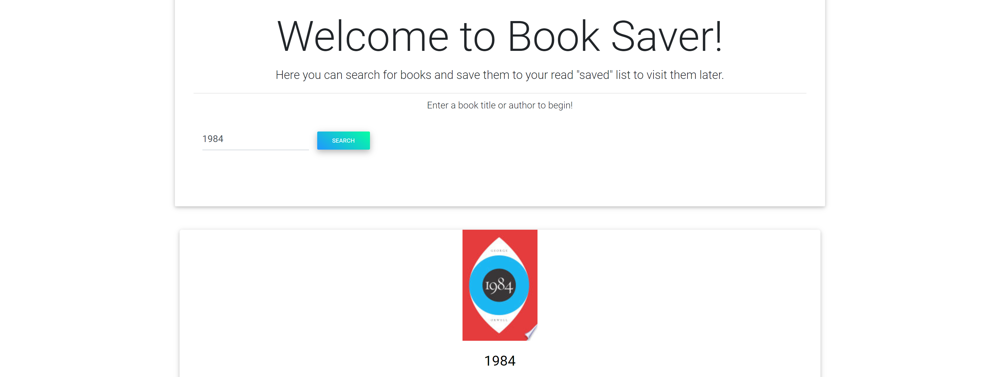

# BookSaver
Search Google Books using Google Books API. After finding a book you like, you can save it to a list and view your saved books to later view. After you are done with your saved book, you can then delete it from your list. [Click here to visit Website](https://afternoon-basin-75617.herokuapp.com/).

  
# Table of Contents
* [Description](#BookSaver)
* [Installation](#Installation)
* [Usage](#Usage)
* [License](#License)
* [Tests](#Tests)
* [Questions](#Questions)

# Installation
npm install

# Usage
npm start

# License
This work is licensed under the following:
* [MIT](https://opensource.org/licenses/MIT)

# Tests
npm start

# Questions

[Click Here to Visit my GitHub](https://github.com/vivid-green)

Email me with questions: zacharycreek@gmail.com
